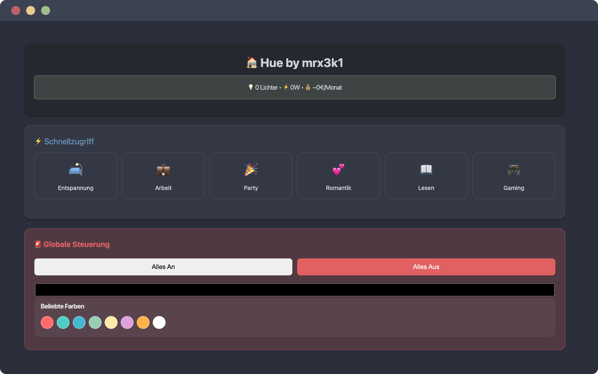
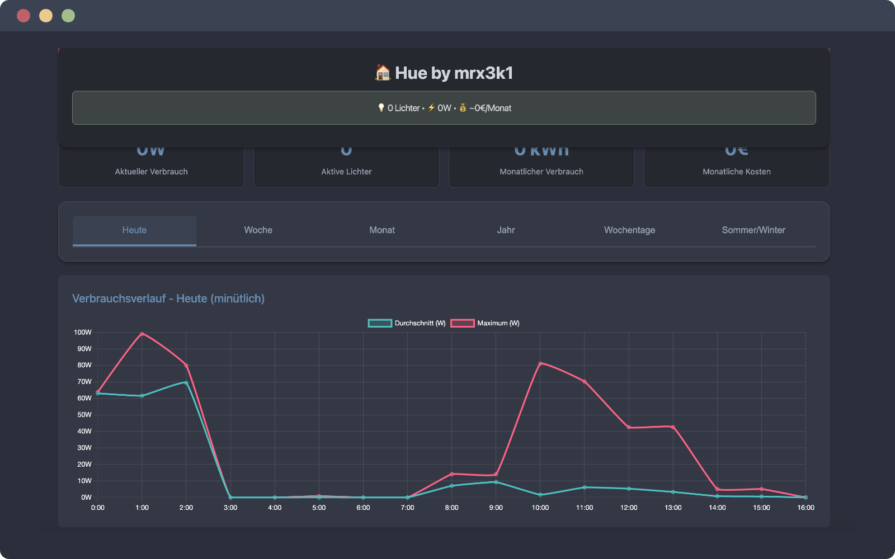
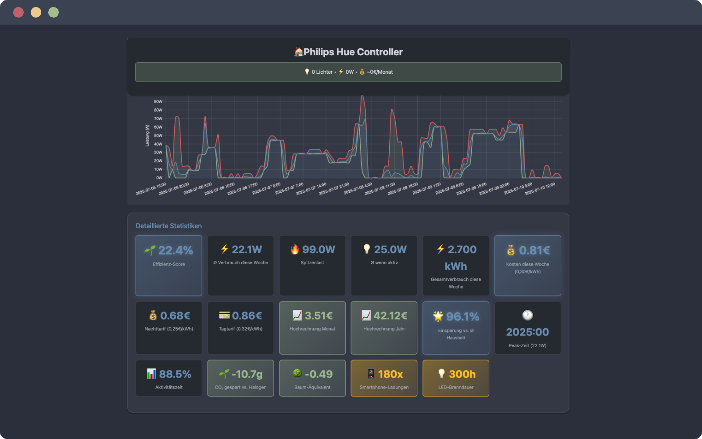

# 🏠 Hue by mrx3k1

Eine moderne, umfassende Web-Anwendung zur Steuerung von Philips Hue Smart Lighting mit erweiterten Effekten, Stromverbrauch-Monitoring und eleganter Benutzeroberfläche.


## 📱 Screenshots

### Hauptansicht mit Lichtsteuerung


### Stromverbrauch-Monitoring


### Individuelle Lampen-Analyse


## ✨ Features

### 🎮 Intelligente Lichtsteuerung
- **Einzellicht-Kontrolle**: Helligkeit, Farbe, Ein/Aus für jedes Licht
- **Gruppen-Management**: Steuerung mehrerer Lichter gleichzeitig
- **Szenen-Aktivierung**: Vordefinierte Lichtszenen für verschiedene Stimmungen
- **Globale Steuerung**: Alle Lichter mit einem Klick steuern + Notaus-Funktion

### 🎨 Erweiterte Lichteffekte
- **Strobo-Effekte**: Intelligente Stroboskop-Effekte mit 4 Geschwindigkeitsstufen
  - **Schnell**: 3-8 Hz für intensive Partystimmung
  - **Mittel**: 1-3 Hz für dramatische Effekte
  - **Langsam**: 0.5-1 Hz für atmosphärische Beleuchtung
  - **Variabel**: 0.5-8 Hz für maximale Variation
- **Individuelle Lichtkontrolle**: Strobo nur für ausgewählte Lichter
- **Farbsynchronisation**: Echtzeit-Farbwechsel während aktiver Effekte
- **Visuelle Rückmeldung**: Pulsierende Kartenglow-Effekte bei aktiven Strobos
- **Raumwelle**: Farben laufen sequenziell durch alle Lichter
- **Pulsieren**: Rhythmisches Dimmen aller Lichter
- **Regenbogen**: Sanfte Farbübergänge durch das gesamte Spektrum
- **Feuereffekt**: Warme, flackernde Farben mit zufälligen Variationen
- **Sonnenuntergang**: Automatische Farbtemperatur-Progression
- **Blitzeffekt**: Zufällige Blitze auf ausgewählten Lichtern
- **Audio-Sync**: Lichtsteuerung basierend auf Mikrofon-Input
- **Effekt-Builder**: Benutzerdefinierte Effekte erstellen und speichern

### ⚡ Stromverbrauch-Monitoring
- **Live-Tracking**: Echtzeit-Anzeige des aktuellen Verbrauchs
- **Historische Daten**: Automatische Speicherung alle 5 Minuten
- **Interaktive Charts**: Tages- und Stundenverläufe mit Chart.js
- **Top-Verbraucher**: Analyse der energieintensivsten Lichter
- **Kostenberechnung**: Geschätzte monatliche Stromkosten

### 🎯 Schnellzugriff-Szenen
- **Entspannung**: Warmes, gedimmtes Licht
- **Arbeit**: Helles, weißes Licht für Produktivität
- **Party**: Lebendige, bunte Beleuchtung
- **Romantik**: Sanftes rot/rosa Ambiente
- **Lesen**: Optimales weißes Licht zum Lesen
- **Gaming**: Dynamische farbige Beleuchtung

### ⏰ Timer & Automatisierung
- **Verzögerte Aktionen**: Lichter nach bestimmter Zeit schalten
- **Aktive Timer-Übersicht**: Verwaltung aller laufenden Timer
- **Flexible Ziele**: Timer für einzelne Lichter oder Gruppen

## 🚀 Installation

### Voraussetzungen
- **Python 3.11+**
- **MariaDB/MySQL**
- **Philips Hue Bridge** im lokalen Netzwerk
- **Hue API-Key** (siehe Setup-Anleitung)

### 1. Repository klonen
```bash
git clone https://github.com/pepperonas/hue-controller.git
cd hue-controller
```

### 2. Automatische Einrichtung (Empfohlen)
```bash
# Python Virtual Environment erstellen
python3 -m venv venv --system-site-packages
venv/bin/pip install flask flask-cors requests mysql-connector-python

# Datenbank einrichten
sudo mysql -u root -e "CREATE DATABASE IF NOT EXISTS hue_monitoring; CREATE USER IF NOT EXISTS 'hueuser'@'localhost' IDENTIFIED BY 'password'; GRANT ALL PRIVILEGES ON hue_monitoring.* TO 'hueuser'@'localhost'; FLUSH PRIVILEGES;"

# Datenbank-Tabellen erstellen
echo -e "y\ny" | venv/bin/python3 test_db.py
```

### 3. Umgebungsvariablen konfigurieren
Die `.env` Datei bereits vorhanden ist, aktualisiere sie:
```bash
nano .env
```

Trage deine Hue Bridge-IP und API-Key ein:
```env
# Hue Bridge Konfiguration
HUE_BRIDGE_IP=192.168.2.35
HUE_USERNAME=your_hue_api_key_here

# Datenbank Konfiguration (MySQL/MariaDB)
DB_HOST=localhost
DB_USER=hueuser
DB_PASSWORD=password
DB_NAME=hue_monitoring

# Flask Konfiguration
FLASK_PORT=5000
FLASK_DEBUG=false
FLASK_ENV=production
```

### 4. Hue API-Key generieren
Wenn du noch keinen API-Key hast, kannst du diesen generieren:
```bash
# Hue Bridge IP finden
nmap -sn 192.168.1.0/24 | grep -B2 "Philips"

# API-Key generieren (Bridge-Button drücken, dann innerhalb 30 Sekunden):
curl -X POST http://YOUR_BRIDGE_IP/api -d '{"devicetype":"HueController#RaspberryPi"}'
```

Alternativ verwende den **Onboarding-Wizard** für eine geführte Einrichtung:
```bash
# Onboarding-Seite öffnen
http://localhost:5000/onboarding.html
```

## 🎯 Anwendung starten

### Entwicklung
```bash
source venv/bin/activate
python3 app_lite.py
```

### Produktiv (Hintergrund)
```bash
nohup venv/bin/python3 app_lite.py > /dev/null 2>&1 &
```

### Mit PM2 (empfohlen)
```bash
npm install -g pm2

# Mit PM2-Management-Script (empfohlen)
./pm2-manage.sh start       # Anwendung starten
./pm2-manage.sh status      # Status prüfen  
./pm2-manage.sh logs        # Logs anzeigen
./pm2-manage.sh restart     # Neustart
./pm2-manage.sh stop        # Stoppen
./pm2-manage.sh health      # Health-Check

# Auto-Start beim Systemboot einrichten
./pm2-manage.sh startup     # Systemd-Service konfigurieren
# Folge den Anweisungen, dann:
./pm2-manage.sh save        # Aktuelle Konfiguration speichern

# Oder direkt mit PM2
pm2 start ecosystem.config.js
pm2 logs hue-controller
pm2 startup                 # Auto-Start konfigurieren
pm2 save                    # Konfiguration speichern
```

## 🌐 Verwendung

1. **Web-Interface öffnen**: `http://hue.pi.local` oder `http://localhost:5000`
2. **Tabs navigieren**: Lichter, Gruppen, Szenen, Effekte, Timer, Stromverbrauch
3. **Schnellzugriff nutzen**: Direkte Szenen-Buttons im oberen Bereich
4. **Globale Steuerung**: Alle Lichter gleichzeitig steuern
5. **Notaus**: Schwebender roter Button für sofortiges Ausschalten

### Mobile Optimierung
- **Touch-freundlich**: Große Buttons und Slider
- **Responsive Design**: Funktioniert auf Smartphones und Tablets
- **Glassmorphism UI**: Moderne, ansprechende Benutzeroberfläche

## 📊 API-Endpoints

### Licht-Steuerung
- `GET /api/lights` - Alle Lichter auflisten
- `PUT /api/lights/<id>/state` - Einzelnes Licht steuern
- `PUT /api/groups/<id>/action` - Lichtgruppe steuern

### Globale Steuerung
- `PUT /api/global/all-lights` - Alle Lichter gleichzeitig steuern
- `POST /api/global/emergency-off` - Notfall-Ausschaltung aller Lichter
- `PUT /api/global/all-groups` - Alle Gruppen gleichzeitig steuern

### Effekte & Animationen
- `POST /api/effects/strobe` - Strobo-Effekt mit konfigurierbarer Geschwindigkeit
- `POST /api/effects/colorloop` - Farbschleife starten
- `POST /api/effects/advanced/<type>` - Erweiterte Effekte (wave, pulse, rainbow, fire, sunset, lightning)
- `GET /api/effects` - Liste aktiver Effekte
- `DELETE /api/effects/<id>/stop` - Spezifischen Effekt stoppen

### Timer & Automatisierung
- `POST /api/timer` - Timer für verzögerte Aktionen erstellen
- `GET /api/sensors` - Sensoren/Schalter auflisten

### Stromverbrauch
- `GET /api/power/current` - Aktueller Verbrauch mit Datenbank-Status
- `GET /api/power/history` - Historische Daten (täglich, stündlich, Top-Verbraucher)

### System
- `GET /api/status` - System-Status und Verbindungsinformationen

## 🛠️ Entwicklung

### Projekt-Struktur
```
hue-controller/
├── app_lite.py              # Haupt-Flask-Anwendung
├── test_db.py              # Datenbank-Tests und Setup
├── public/                  # Frontend-Dateien (Templates & Static)
│   ├── index.html          # Haupt-Frontend (SPA)
│   └── onboarding.html     # Setup-Assistent
├── logs/                   # Log-Dateien (PM2)
│   ├── combined.log
│   ├── error.log
│   └── out.log
├── ecosystem.config.js     # PM2-Konfiguration
├── pm2-manage.sh          # PM2-Management-Script
├── .env                    # Umgebungsvariablen
├── CLAUDE.md              # Entwickler-Dokumentation
├── CLAUDE.local.md        # Lokale Entwickler-Notizen
└── venv/                  # Python Virtual Environment
```

**Wichtiger Hinweis**: Das `public/` Verzeichnis wurde von `templates/` umbenannt für eine klarere Struktur. Flask ist entsprechend konfiguriert (`template_folder='public'`).

### Technologie-Stack
- **Backend**: Flask mit CORS-Support und Smart Error Handling
- **Frontend**: Vanilla JavaScript, HTML5, CSS3 mit Glassmorphism Design
- **Datenbank**: MariaDB/MySQL mit Connection Pooling
- **Charts**: Chart.js für Visualisierungen
- **Threading**: Python Threads für Effekte und Timer
- **Audio**: PyAudio für Mikrofon-basierte Lichtsteuerung
- **Logging**: Strukturiertes Logging-System mit Rotation

### Datenbank-Schema
```sql
-- Stromverbrauch pro Licht
CREATE TABLE power_log (
    id INT AUTO_INCREMENT PRIMARY KEY,
    timestamp DATETIME NOT NULL,
    light_id VARCHAR(10) NOT NULL,
    light_name VARCHAR(100) NOT NULL,
    watts DECIMAL(5,2) NOT NULL,
    brightness INT NOT NULL,
    INDEX idx_timestamp (timestamp),
    INDEX idx_light_id (light_id)
);

-- Gesamtverbrauch-Tracking
CREATE TABLE total_consumption (
    id INT AUTO_INCREMENT PRIMARY KEY,
    timestamp DATETIME NOT NULL,
    total_watts DECIMAL(7,2) NOT NULL,
    active_lights INT NOT NULL,
    INDEX idx_timestamp (timestamp)
);
```

### Logging & Monitoring
- **Power-Monitoring**: Automatisch alle 5 Minuten in Datenbank
- **Effekt-Tracking**: Laufende Effekte in Memory mit Thread-IDs
- **Connection Pooling**: MySQL-Pool mit 5 Verbindungen
- **Fehlerbehandlung**: Graceful Fallback bei DB-Problemen

## 🔧 Wartung

### Logs prüfen
```bash
# PM2 Logs mit Management-Script
./pm2-manage.sh logs        # Letzte 50 Zeilen
./pm2-manage.sh monit       # Live-Monitoring

# Direkte PM2 Logs
pm2 logs hue-controller

# Log-Dateien
tail -f logs/combined.log
tail -f logs/error.log
tail -f logs/out.log
```

### Datenbank-Wartung
```bash
# Backup erstellen
mysqldump -u hueuser -p hue_monitoring > backup.sql

# Alte Daten löschen (älter als 30 Tage)
mysql -u hueuser -p -e "DELETE FROM hue_monitoring.power_log WHERE timestamp < DATE_SUB(NOW(), INTERVAL 30 DAY);"
```

### Updates
```bash
# Mit PM2-Management-Script (automatisch)
./pm2-manage.sh update      # Git pull, Dependencies, Neustart

# Oder manuell
git pull origin main
venv/bin/pip install flask flask-cors requests mysql-connector-python

# Mit PM2-Script neustarten
./pm2-manage.sh restart

# Oder direkt mit PM2
pm2 restart hue-controller
```

## 🐛 Fehlerbehebung

### Häufige Probleme

1. **Hue Bridge nicht erreichbar**
   ```bash
   ping YOUR_BRIDGE_IP
   curl http://YOUR_BRIDGE_IP/api/config
   ```

2. **Datenbank-Verbindungsfehler**
   ```bash
   sudo systemctl status mariadb
   mysql -u hueuser -p
   ```

3. **Port bereits belegt**
   ```bash
   lsof -i :5000
   kill -9 <PID>
   ```

4. **API-Key ungültig**
   - Neuen API-Key generieren (siehe Installation)
   - `.env` Datei aktualisieren

### Debug-Modus
```bash
export FLASK_DEBUG=true
python3 app_lite.py
```

## 📈 Performance

- **Speicherverbrauch**: ~50MB RAM
- **CPU-Last**: Minimal (Threading für Effekte)
- **Netzwerk**: Lokale Bridge-Kommunikation
- **Datenbank**: ~1MB pro Tag bei 11 Lichtern

## 🔒 Sicherheit

- **Lokales Netzwerk**: Nur für lokale IP-Adressen gedacht
- **API-Key-Schutz**: Hue-Credentials in Umgebungsvariablen
- **Keine Authentifizierung**: Web-Interface ohne Login (LAN-intern)

## 📝 Changelog

### Version 2.4 (Juli 2025 - Aktuell)
- ✅ **Ordnerstruktur**: `templates/` Verzeichnis zu `public/` umbenannt für bessere Klarheit
- ✅ **Datenbank-Schema**: Vollständige Schema-Dokumentation in README
- ✅ **API-Dokumentation**: Erweiterte Endpoint-Liste mit allen verfügbaren Funktionen
- ✅ **Onboarding-Wizard**: Setup-Assistent für einfache Erstkonfiguration
- ✅ **Erweiterte Threading**: Daemon-Threads für Effekte mit eindeutigen IDs

### Version 2.3
- ✅ **Power-Monitoring-Charts**: Datenbank konfiguriert und Stromverbrauchsdaten verfügbar
- ✅ **Subdomain-Zugriff**: Verfügbar über http://hue.pi.local (nginx Reverse Proxy)
- ✅ **MySQL Integration**: Vollständig funktionsfähig mit automatischem Power-Logging
- ✅ **Intelligente Strobo-Effekte**: 4 Geschwindigkeitsstufen (Schnell/Mittel/Langsam/Variabel)
- ✅ **Individuelle Lichtsteuerung**: Strobo nur für ausgewählte Lichter statt alle gleichzeitig
- ✅ **Echtzeit-Farbwechsel**: Farbänderungen während aktiver Strobo-Effekte
- ✅ **Visuelle Rückmeldung**: Pulsierende Glow-Effekte an Karten bei aktiven Strobos
- ✅ **Verbesserte UI**: Styled Dropdowns mit persistenten Auswahlen
- ✅ **Zuverlässige Steuerung**: Fallback-Mechanismen für fehlerfreies Stoppen von Effekten
- ✅ **Toast-Nachrichten**: Verbesserte Lesbarkeit mit kontrastreicheren Farben

### Version 2.2
- ✅ **Erweiterte Effekte**: Erste Generation der Strobo-Effekte implementiert

### Version 2.1
- ✅ Vollständige PM2-Integration mit Management-Script
- ✅ Systemd Auto-Start Konfiguration
- ✅ Vereinfachte Installation mit einem Befehl
- ✅ Health-Check und Monitoring-Features
- ✅ Automatische Updates über PM2-Script

### Version 2.0
- ✅ Vollständige Datenbank-Integration
- ✅ Live-Charts mit Chart.js
- ✅ Automatisches Power-Logging
- ✅ Erweiterte Lichteffekte
- ✅ Mobile-optimierte UI

### Version 1.0
- ✅ Grundlegende Lichtsteuerung
- ✅ Szenen und Gruppen
- ✅ Timer-Funktionalität
- ✅ Erste Effekte (Strobo, Colorloop)

## 🤝 Beitragen

1. Fork das Repository
2. Feature-Branch erstellen: `git checkout -b feature/AmazingFeature`
3. Änderungen committen: `git commit -m 'Add AmazingFeature'`
4. Branch pushen: `git push origin feature/AmazingFeature`
5. Pull Request erstellen

## 📄 Lizenz

Dieses Projekt ist unter der MIT-Lizenz veröffentlicht. Siehe `LICENSE` Datei für Details.

## 👤 Entwickler

**Martin Pfeffer** - 2025

## 📄 License

MIT License

Copyright (c) 2025 Martin Pfeffer

Permission is hereby granted, free of charge, to any person obtaining a copy
of this software and associated documentation files (the "Software"), to deal
in the Software without restriction, including without limitation the rights
to use, copy, modify, merge, publish, distribute, sublicense, and/or sell
copies of the Software, and to permit persons to whom the Software is
furnished to do so, subject to the following conditions:

The above copyright notice and this permission notice shall be included in all
copies or substantial portions of the Software.

THE SOFTWARE IS PROVIDED "AS IS", WITHOUT WARRANTY OF ANY KIND, EXPRESS OR
IMPLIED, INCLUDING BUT NOT LIMITED TO THE WARRANTIES OF MERCHANTABILITY,
FITNESS FOR A PARTICULAR PURPOSE AND NONINFRINGEMENT. IN NO EVENT SHALL THE
AUTHORS OR COPYRIGHT HOLDERS BE LIABLE FOR ANY CLAIM, DAMAGES OR OTHER
LIABILITY, WHETHER IN AN ACTION OF CONTRACT, TORT OR OTHERWISE, ARISING FROM,
OUT OF OR IN CONNECTION WITH THE SOFTWARE OR THE USE OR OTHER DEALINGS IN THE
SOFTWARE.

## 🙏 Danksagungen

- Philips Hue für die ausgezeichnete API
- Chart.js Community für die Visualisierungs-Bibliothek
- Flask-Team für das großartige Web-Framework