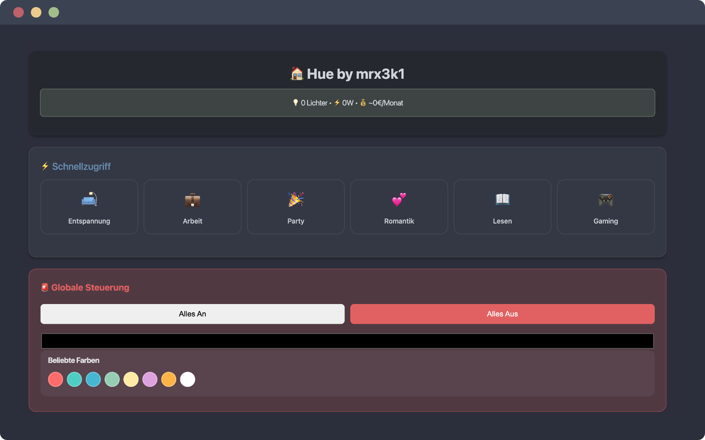
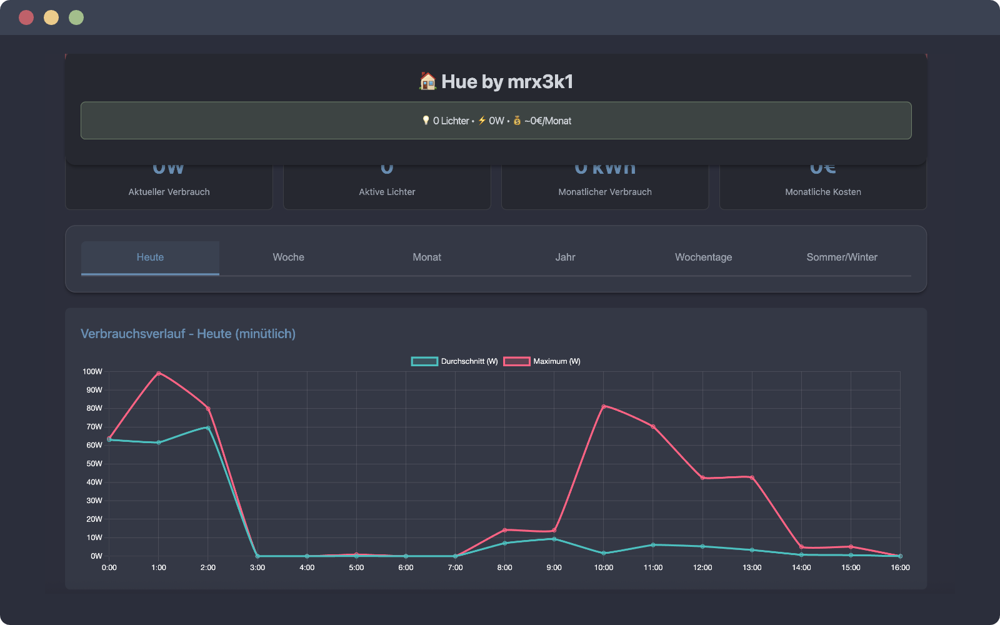
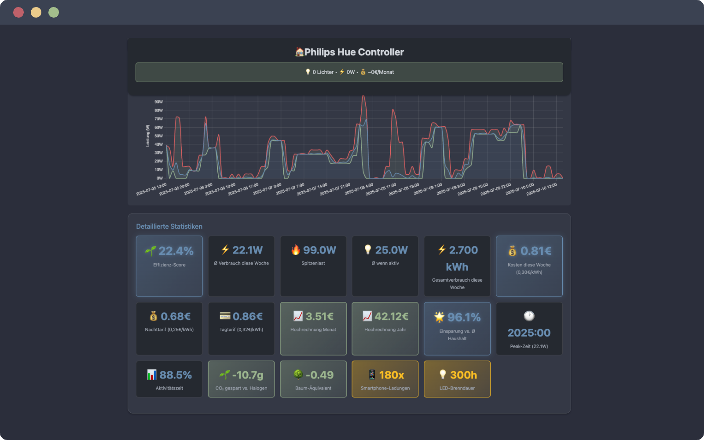

# 🏠 Hue by mrx3k1

Eine moderne, umfassende Web-Anwendung zur Steuerung von Philips Hue Smart Lighting mit erweiterten Effekten, Stromverbrauch-Monitoring und eleganter Benutzeroberfläche.


## 📱 Screenshots

### Hauptansicht mit Lichtsteuerung


### Stromverbrauch-Monitoring


### Individuelle Lampen-Analyse


## ✨ Features

### 🎮 Intelligente Lichtsteuerung
- **Einzellicht-Kontrolle**: Helligkeit, Farbe, Ein/Aus für jedes Licht
- **Gruppen-Management**: Steuerung mehrerer Lichter gleichzeitig
- **Szenen-Aktivierung**: Vordefinierte Lichtszenen für verschiedene Stimmungen
- **Globale Steuerung**: Alle Lichter mit einem Klick steuern + Notaus-Funktion

### 🎨 Erweiterte Lichteffekte
- **Strobo-Effekte**: Intelligente Stroboskop-Effekte mit 4 Geschwindigkeitsstufen
  - **Schnell**: 3-8 Hz für intensive Partystimmung
  - **Mittel**: 1-3 Hz für dramatische Effekte
  - **Langsam**: 0.5-1 Hz für atmosphärische Beleuchtung
  - **Variabel**: 0.5-8 Hz für maximale Variation
- **Individuelle Lichtkontrolle**: Strobo nur für ausgewählte Lichter
- **Farbsynchronisation**: Echtzeit-Farbwechsel während aktiver Effekte
- **Visuelle Rückmeldung**: Pulsierende Kartenglow-Effekte bei aktiven Strobos

### 🎵 Audio-Reaktive Beleuchtung (Disko-Modus)
- **FFT-Frequenzanalyse**: Echtzeit-Spektralanalyse mit 2048-Sample-Fenster
- **5 Frequenzbänder**: Bass (20-250Hz), Low-Mid (250-500Hz), Mid (500-2kHz), High-Mid (2-4kHz), Treble (4-8kHz)
- **Intelligente Farbmappings**:
  - 🔴 **Bass → Rot** (kraftvoll, warm für Kick Drums & Bass)
  - 🟠 **Low-Mid → Orange** (warme Instrumente)
  - 🟡 **Mid → Gelb** (Vocals, Gitarren)
  - 🔵 **High-Mid → Blau** (Snare, obere Harmonien)
  - 🟣 **Treble → Lila** (Hi-Hats, Cymbals)
- **Dominante Frequenz-Erkennung**: Lichter reagieren auf das stärkste Frequenzband
- **Bass-Boost**: Extra Helligkeit bei starken Bässen
- **Live-Visualisierung**: Echtzeit-Frequenzbalken im Web-Interface
- **Adaptives Farbmischen**: Mehrere Frequenzbänder werden gewichtet gemischt
- **Optimierte Performance**: 50ms Audio-Updates, 150ms Hue-Updates

### 🌈 Weitere Lichteffekte
- **Raumwelle**: Farben laufen sequenziell durch alle Lichter
- **Pulsieren**: Rhythmisches Dimmen aller Lichter
- **Regenbogen**: Sanfte Farbübergänge durch das gesamte Spektrum
- **Feuereffekt**: Warme, flackernde Farben mit zufälligen Variationen
- **Sonnenuntergang**: Automatische Farbtemperatur-Progression
- **Blitzeffekt**: Zufällige Blitze auf ausgewählten Lichtern
- **Effekt-Builder**: Benutzerdefinierte Effekte erstellen und speichern

### ⚡ Stromverbrauch-Monitoring
- **Live-Tracking**: Echtzeit-Anzeige des aktuellen Verbrauchs
- **Historische Daten**: Automatische Speicherung alle 5 Minuten
- **Interaktive Charts**: Tages- und Stundenverläufe mit Chart.js
- **Top-Verbraucher**: Analyse der energieintensivsten Lichter
- **Kostenberechnung**: Geschätzte monatliche Stromkosten

### 🎯 Schnellzugriff-Szenen
- **Entspannung**: Warmes, gedimmtes Licht
- **Arbeit**: Helles, weißes Licht für Produktivität
- **Party**: Lebendige, bunte Beleuchtung
- **Romantik**: Sanftes rot/rosa Ambiente
- **Lesen**: Optimales weißes Licht zum Lesen
- **Gaming**: Dynamische farbige Beleuchtung

### ⏰ Timer & Automatisierung
- **Verzögerte Aktionen**: Lichter nach bestimmter Zeit schalten
- **Aktive Timer-Übersicht**: Verwaltung aller laufenden Timer
- **Flexible Ziele**: Timer für einzelne Lichter oder Gruppen

### 🔘 Custom Buttons (GPIO)
- **Hardware-Integration**: Physische GPIO-Buttons für direkte Lichtsteuerung
- **GPIO-Pin Mapping**: Konfiguration von GPIO-Pins zu Hue-Gruppen über Web-UI
- **Debouncing**: 200ms Hardware-Debouncing für zuverlässige Buttonerkennung
- **Single/Double Press**: Single Press = Toggle, Double Press = Aus
- **Strobo with State Restore**: Strobo-Effekte mit automatischer Wiederherstellung der ursprünglichen Lichteinstellungen
- **Real-time Logging**: Vollständige Button-Aktivitäts-Protokollierung in Datenbank
- **Web-Konfiguration**: "Custom Buttons" Tab zur einfachen Pin-zu-Gruppe-Zuordnung
- **Button-Test-Scripts**: Dedicated Test-Tools für GPIO-Button-Debugging

### 🚶 PIR Motion Sensor (Erweitert)
- **Automatische Beleuchtung**: PIR-Sensor triggert automatisch Garten-Beleuchtung
- **Raspberry Pi 5 Support**: gpiozero-Integration für moderne GPIO-Hardware
- **Konfigurierbare Parameter**: GPIO Pin, Beleuchtungsdauer, Cooldown-Zeit
- **Smart Activation**: Warmweißes Licht (2700K) mit 100% Helligkeit für 3 Minuten
- **Motion Logging**: Automatische Protokollierung aller Bewegungserkennungen
- **Intelligente Zeitsteuerung**: ⭐ **NEU** - Sonnenauf-/untergangsberechnung für Berlin
- **Tageslichteerkennung**: ⭐ **NEU** - Automatisch nur nachts aktiv (zwischen Sonnenuntergang und Sonnenaufgang)
- **Flexible Konfiguration**: ⭐ **NEU** - Toggle für 24h Betrieb oder zeitbasierte Aktivierung
- **Erweiterte Web-Steuerung**: ⭐ **NEU** - Separate Toggles für Bewegungserkennung und Tageslichteerkennung
- **Sonnenzeiten-Übersicht**: ⭐ **NEU** - 7-Tage-Vorhersage der Sonnenauf-/untergangszeiten
- **Web-Verwaltung**: PIR-Status und -Konfiguration über Web-Interface

## 🚀 Installation

### Voraussetzungen
- **Python 3.11+**
- **MariaDB/MySQL**
- **Philips Hue Bridge** im lokalen Netzwerk
- **Hue API-Key** (siehe Setup-Anleitung)
- **Raspberry Pi** mit GPIO-Zugriff (für Custom Buttons)
- **GPIO-Bibliotheken**: `gpiozero`, `RPi.GPIO`, `lgpio`
- **Audio-Bibliotheken**: `pyaudio`, `scipy` (für Disko-Modus)
- **USB-Mikrofon** oder integriertes Mikrofon (für Audio-Reaktivität)

### 1. Repository klonen
```bash
git clone https://github.com/pepperonas/hue-controller.git
cd hue-controller
```

### 2. Automatische Einrichtung (Empfohlen)
```bash
# System-Pakete für Audio installieren
sudo apt update && sudo apt install -y python3-gpiozero portaudio19-dev python3-pyaudio

# Python Virtual Environment erstellen
python3 -m venv venv --system-site-packages
venv/bin/pip install flask flask-cors requests mysql-connector-python pyaudio scipy numpy

# GPIO-Bibliotheken für Custom Buttons installieren
sudo pip3 install RPi.GPIO lgpio
sudo usermod -a -G gpio pi  # GPIO-Zugriff für pi-Benutzer

# Datenbank einrichten
sudo mysql -u root -e "CREATE DATABASE IF NOT EXISTS hue_monitoring; CREATE USER IF NOT EXISTS 'hueuser'@'localhost' IDENTIFIED BY 'password'; GRANT ALL PRIVILEGES ON hue_monitoring.* TO 'hueuser'@'localhost'; FLUSH PRIVILEGES;"

# Datenbank-Tabellen erstellen
echo -e "y\ny" | venv/bin/python3 test_db.py
```

### 3. Umgebungsvariablen konfigurieren
Die `.env` Datei bereits vorhanden ist, aktualisiere sie:
```bash
nano .env
```

Trage deine Hue Bridge-IP und API-Key ein:
```env
# Hue Bridge Konfiguration
HUE_BRIDGE_IP=192.168.2.35
HUE_USERNAME=your_hue_api_key_here

# Datenbank Konfiguration (MySQL/MariaDB)
DB_HOST=localhost
DB_USER=hueuser
DB_PASSWORD=password
DB_NAME=hue_monitoring

# Flask Konfiguration
FLASK_PORT=5000
FLASK_DEBUG=false
FLASK_ENV=production
```

### 4. Hue API-Key generieren
Wenn du noch keinen API-Key hast, kannst du diesen generieren:
```bash
# Hue Bridge IP finden
nmap -sn 192.168.1.0/24 | grep -B2 "Philips"

# API-Key generieren (Bridge-Button drücken, dann innerhalb 30 Sekunden):
curl -X POST http://YOUR_BRIDGE_IP/api -d '{"devicetype":"HueController#RaspberryPi"}'
```

Alternativ verwende den **Onboarding-Wizard** für eine geführte Einrichtung:
```bash
# Onboarding-Seite öffnen
http://localhost:5000/onboarding.html
```

## 🎯 Anwendung starten

### Entwicklung
```bash
source venv/bin/activate
python3 app_lite.py
```

### Produktiv (Hintergrund)
```bash
nohup venv/bin/python3 app_lite.py > /dev/null 2>&1 &
```

### Mit PM2 (empfohlen)
```bash
npm install -g pm2

# Mit PM2-Management-Script (empfohlen)
./pm2-manage.sh start       # Anwendung starten
./pm2-manage.sh status      # Status prüfen  
./pm2-manage.sh logs        # Logs anzeigen
./pm2-manage.sh restart     # Neustart
./pm2-manage.sh stop        # Stoppen
./pm2-manage.sh health      # Health-Check

# Auto-Start beim Systemboot einrichten
./pm2-manage.sh startup     # Systemd-Service konfigurieren
# Folge den Anweisungen, dann:
./pm2-manage.sh save        # Aktuelle Konfiguration speichern

# Oder direkt mit PM2
pm2 start ecosystem.config.js
pm2 logs hue-controller
pm2 startup                 # Auto-Start konfigurieren
pm2 save                    # Konfiguration speichern
```

## 🌐 Verwendung

1. **Web-Interface öffnen**: `http://hue.pi.local` oder `http://localhost:5000`
2. **Tabs navigieren**: Lichter, Gruppen, Szenen, Effekte, Timer, Stromverbrauch
3. **Schnellzugriff nutzen**: Direkte Szenen-Buttons im oberen Bereich
4. **Globale Steuerung**: Alle Lichter gleichzeitig steuern
5. **Notaus**: Schwebender roter Button für sofortiges Ausschalten

### 🎵 Disko-Modus verwenden

1. **Mikrofon anschließen**: USB-Mikrofon oder integriertes Mikrofon verwenden
2. **Disko-Modus aktivieren**: "🕺 Disko-Modus" Button in der globalen Steuerung
3. **Frequenz-Display**: Live-Balkendiagramm zeigt aktive Frequenzbänder
4. **Musik abspielen**: Lichter reagieren automatisch auf verschiedene Instrumente:
   - **Bass Drums** → Rote Lichter mit extra Helligkeit
   - **Vocals/Gitarren** → Gelbe/Orange Lichter
   - **Hi-Hats/Cymbals** → Blaue/Lila Lichter
   - **Vollspektrum-Musik** → Dynamische Farbmischung
5. **Button-Feedback**: Disko-Button wechselt Farbe je nach dominanter Frequenz
6. **Deaktivieren**: Nochmals auf Button klicken zum Stoppen

### Mobile Optimierung
- **Touch-freundlich**: Große Buttons und Slider
- **Responsive Design**: Funktioniert auf Smartphones und Tablets
- **Glassmorphism UI**: Moderne, ansprechende Benutzeroberfläche
- **PWA-Ready**: Installierbar als App auf Smartphone-Homescreen mit optimierten Favicons für Samsung S24 Ultra

## 📊 API-Endpoints

### Licht-Steuerung
- `GET /api/lights` - Alle Lichter auflisten
- `PUT /api/lights/<id>/state` - Einzelnes Licht steuern
- `PUT /api/groups/<id>/action` - Lichtgruppe steuern

### Globale Steuerung
- `PUT /api/global/all-lights` - Alle Lichter gleichzeitig steuern
- `POST /api/global/emergency-off` - Notfall-Ausschaltung aller Lichter
- `PUT /api/global/all-groups` - Alle Gruppen gleichzeitig steuern

### Effekte & Animationen
- `POST /api/effects/strobe` - Strobo-Effekt mit konfigurierbarer Geschwindigkeit
- `POST /api/effects/colorloop` - Farbschleife starten
- `POST /api/effects/advanced/<type>` - Erweiterte Effekte (wave, pulse, rainbow, fire, sunset, lightning)
- `GET /api/effects` - Liste aktiver Effekte
- `DELETE /api/effects/<id>/stop` - Spezifischen Effekt stoppen

### Audio-Reaktive Beleuchtung (Disko-Modus)
- `POST /api/disco-mode/start` - Disko-Modus (Audio-reaktive Beleuchtung) starten
- `POST /api/disco-mode/stop` - Disko-Modus stoppen
- `GET /api/disco-mode/status` - Status mit Frequenzband-Analyse und dominanter Frequenz

### Timer & Automatisierung
- `POST /api/timer` - Timer für verzögerte Aktionen erstellen
- `GET /api/sensors` - Sensoren/Schalter auflisten

### Stromverbrauch
- `GET /api/power/current` - Aktueller Verbrauch mit Datenbank-Status
- `GET /api/power/history` - Historische Daten (täglich, stündlich, Top-Verbraucher)

### Custom Buttons (GPIO)
- `GET /api/buttons/status` - GPIO-Manager-Status und aktive Button-Konfigurationen
- `GET /api/buttons` - Alle Button-Konfigurationen auflisten
- `POST /api/buttons` - Neue Button-Konfiguration erstellen
- `PUT /api/buttons/<gpio_pin>` - Button-Konfiguration aktualisieren
- `DELETE /api/buttons/<gpio_pin>` - Button-Konfiguration löschen
- `GET /api/buttons/logs` - Button-Press-Logs abrufen
- `POST /api/buttons/reload` - Button-Konfigurationen neu laden

### PIR Motion Sensor (Erweitert)
- `GET /api/pir/status` - PIR-Sensor-Status und Konfiguration (inkl. Sonnenzeiten)
- `POST /api/pir/toggle` - PIR-Monitoring ein-/ausschalten
- `POST /api/pir/test` - Manueller PIR-Test (Bewegung simulieren)
- `POST /api/pir/config` - ⭐ **NEU** - PIR-Konfiguration ändern (Bewegungserkennung/Tageslichteerkennung Toggles)
- `GET /api/pir/sunrise-sunset` - ⭐ **NEU** - Sonnenauf-/untergangszeiten für Berlin (7-Tage-Vorhersage)

### System
- `GET /api/status` - System-Status und Verbindungsinformationen

## 🛠️ Entwicklung

### Projekt-Struktur
```
hue-controller/
├── app_lite.py              # Haupt-Flask-Anwendung
├── disco_mode.py            # Audio-reaktiver Disko-Modus mit FFT-Analyse
├── gpio_manager.py          # GPIO-Button-Manager für Custom Buttons
├── pir_manager.py           # PIR Motion Sensor Manager für automatische Beleuchtung
├── test_db.py              # Datenbank-Tests und Setup
├── but_working.py          # GPIO-Button-Test-Script für direkte Hardware-Tests
├── test_gpio_logging.py    # GPIO-Button-Test-Script mit erweiterten Features
├── check_button_activity.py # Button-Aktivitäts-Monitor
├── public/                  # Frontend-Dateien (Templates & Static)
│   ├── index.html          # Haupt-Frontend (SPA) mit Custom Buttons Tab
│   └── onboarding.html     # Setup-Assistent
├── logs/                   # Log-Dateien (PM2)
│   ├── combined.log
│   ├── error.log
│   └── out.log
├── ecosystem.config.js     # PM2-Konfiguration
├── pm2-manage.sh          # PM2-Management-Script
├── .env                    # Umgebungsvariablen
├── CLAUDE.md              # Entwickler-Dokumentation
├── CLAUDE.local.md        # Lokale Entwickler-Notizen
└── venv/                  # Python Virtual Environment
```

**Wichtiger Hinweis**: Das `public/` Verzeichnis wurde von `templates/` umbenannt für eine klarere Struktur. Flask ist entsprechend konfiguriert (`template_folder='public'`).

### Technologie-Stack
- **Backend**: Flask mit CORS-Support und Smart Error Handling
- **Frontend**: Vanilla JavaScript, HTML5, CSS3 mit Glassmorphism Design
- **Hardware**: GPIO-Integration mit gpiozero für Button-Steuerung
- **Datenbank**: MariaDB/MySQL mit Connection Pooling
- **Charts**: Chart.js für Visualisierungen
- **Threading**: Python Threads für Effekte, Timer und GPIO-Monitoring
- **Audio**: PyAudio mit SciPy FFT für erweiterte Frequenzanalyse
- **Signal Processing**: NumPy für Echtzeit-Spektralanalyse und Frequenzband-Filterung
- **Logging**: Strukturiertes Logging-System mit Rotation

### Datenbank-Schema
```sql
-- Stromverbrauch pro Licht
CREATE TABLE power_log (
    id INT AUTO_INCREMENT PRIMARY KEY,
    timestamp DATETIME NOT NULL,
    light_id VARCHAR(10) NOT NULL,
    light_name VARCHAR(100) NOT NULL,
    watts DECIMAL(5,2) NOT NULL,
    brightness INT NOT NULL,
    INDEX idx_timestamp (timestamp),
    INDEX idx_light_id (light_id)
);

-- Gesamtverbrauch-Tracking
CREATE TABLE total_consumption (
    id INT AUTO_INCREMENT PRIMARY KEY,
    timestamp DATETIME NOT NULL,
    total_watts DECIMAL(7,2) NOT NULL,
    active_lights INT NOT NULL,
    INDEX idx_timestamp (timestamp)
);

-- Custom Button Konfigurationen
CREATE TABLE button_configurations (
    id INT AUTO_INCREMENT PRIMARY KEY,
    gpio_pin INT NOT NULL UNIQUE,
    group_id VARCHAR(10) NOT NULL,
    action_type VARCHAR(20) NOT NULL DEFAULT 'toggle',
    button_name VARCHAR(100),
    description TEXT,
    enabled BOOLEAN DEFAULT TRUE,
    created_at DATETIME NOT NULL DEFAULT CURRENT_TIMESTAMP,
    updated_at DATETIME NOT NULL DEFAULT CURRENT_TIMESTAMP ON UPDATE CURRENT_TIMESTAMP,
    INDEX idx_gpio_pin (gpio_pin),
    INDEX idx_group_id (group_id),
    INDEX idx_enabled (enabled)
);

-- Button Press Logs
CREATE TABLE button_press_log (
    id INT AUTO_INCREMENT PRIMARY KEY,
    gpio_pin INT NOT NULL,
    press_type ENUM('single', 'double') NOT NULL,
    group_id VARCHAR(10) NOT NULL,
    action_type VARCHAR(20) NOT NULL,
    timestamp DATETIME NOT NULL DEFAULT CURRENT_TIMESTAMP,
    INDEX idx_gpio_pin (gpio_pin),
    INDEX idx_timestamp (timestamp)
);
```

### Logging & Monitoring
- **Power-Monitoring**: Automatisch alle 5 Minuten in Datenbank
- **GPIO-Monitoring**: Real-time Button-Press-Erkennung mit Hardware-Debouncing
- **Button-Logging**: Alle Button-Aktivitäten werden in Datenbank protokolliert
- **Effekt-Tracking**: Laufende Effekte in Memory mit Thread-IDs
- **Connection Pooling**: MySQL-Pool mit 5 Verbindungen
- **Fehlerbehandlung**: Graceful Fallback bei DB-Problemen

## 🔧 Wartung

### Logs prüfen
```bash
# PM2 Logs mit Management-Script
./pm2-manage.sh logs        # Letzte 50 Zeilen
./pm2-manage.sh monit       # Live-Monitoring

# Direkte PM2 Logs
pm2 logs hue-controller

# Log-Dateien
tail -f logs/combined.log
tail -f logs/error.log
tail -f logs/out.log

# GPIO Button-Aktivität prüfen
source venv/bin/activate && python3 check_button_activity.py

# GPIO Button Hardware-Test (direkte Button-Erkennung)
sudo python3 but_working.py
```

### Datenbank-Wartung
```bash
# Backup erstellen
mysqldump -u hueuser -p hue_monitoring > backup.sql

# Alte Daten löschen (älter als 30 Tage)
mysql -u hueuser -p -e "DELETE FROM hue_monitoring.power_log WHERE timestamp < DATE_SUB(NOW(), INTERVAL 30 DAY);"
```

### Updates
```bash
# Mit PM2-Management-Script (automatisch)
./pm2-manage.sh update      # Git pull, Dependencies, Neustart

# Oder manuell
git pull origin main
venv/bin/pip install flask flask-cors requests mysql-connector-python

# Mit PM2-Script neustarten
./pm2-manage.sh restart

# Oder direkt mit PM2
pm2 restart hue-controller
```

## 🐛 Fehlerbehebung

### Häufige Probleme

1. **Hue Bridge nicht erreichbar**
   ```bash
   ping YOUR_BRIDGE_IP
   curl http://YOUR_BRIDGE_IP/api/config
   ```

2. **Datenbank-Verbindungsfehler**
   ```bash
   sudo systemctl status mariadb
   mysql -u hueuser -p
   ```

3. **Port bereits belegt**
   ```bash
   lsof -i :5000
   kill -9 <PID>
   ```

4. **API-Key ungültig**
   - Neuen API-Key generieren (siehe Installation)
   - `.env` Datei aktualisieren

5. **GPIO Button-Probleme**
   ```bash
   # Button-Hardware direkt testen
   sudo python3 but_working.py
   
   # GPIO-Pin Status prüfen
   sudo gpio readall
   
   # GPIO-Pin freigeben falls belegt
   echo 21 > /sys/class/gpio/unexport
   echo 26 > /sys/class/gpio/unexport
   ```

### Debug-Modus
```bash
export FLASK_DEBUG=true
python3 app_lite.py
```

## 📈 Performance

- **Speicherverbrauch**: ~50MB RAM
- **CPU-Last**: Minimal (Threading für Effekte)
- **Netzwerk**: Lokale Bridge-Kommunikation
- **Datenbank**: ~1MB pro Tag bei 11 Lichtern

## 🔒 Sicherheit

- **Lokales Netzwerk**: Nur für lokale IP-Adressen gedacht
- **API-Key-Schutz**: Hue-Credentials in Umgebungsvariablen
- **Keine Authentifizierung**: Web-Interface ohne Login (LAN-intern)

## 📝 Changelog

### Version 2.6 (August 2025 - Aktuell)
- ✅ **Favicon-Optimierung**: Vollständige Samsung S24 Ultra-Kompatibilität für Homescreen-Verknüpfungen
- ✅ **PWA-Enhancement**: Erweiterte Meta-Tags und Icons für optimale mobile App-Erfahrung
- ✅ **PIR Motion Sensor Integration**: Automatische Garten-Beleuchtung mit PIR Bewegungsmelder
- ✅ **Raspberry Pi 5 GPIO Support**: gpiozero-Integration für moderne Pi-Hardware
- ✅ **State Backup/Restore System**: Intelligente Wiederherstellung der ursprünglichen Lichteinstellungen nach Strobo-Effekten
- ✅ **Brightness Auto-Activation**: Automatisches Einschalten von Lichtern/Gruppen beim Ändern der Helligkeit
- ✅ **Enhanced Custom Buttons**: Erweiterte Strobo-Button-Funktionalität mit automatischer State-Wiederherstellung
- ✅ **PIR Manager**: Vollständige PIR-Sensor-Verwaltung mit konfigurierbaren Parametern (GPIO Pin, Dauer, Cooldown)
- ✅ **Motion Detection Logging**: Automatische Protokollierung von Bewegungserkennungen in Datenbank
- ✅ **Smart Light Control**: Intelligente Lichtsteuerung - bei ausgeschaltenen Lichtern wird beim Helligkeit-Slider automatisch eingeschaltet
- ✅ **⭐ Intelligente Zeitsteuerung**: Sonnenauf-/untergangsberechnung für Berlin mit astronomischen Formeln
- ✅ **⭐ Tageslichteerkennung**: PIR automatisch nur nachts aktiv (zwischen Sonnenuntergang und Sonnenaufgang)
- ✅ **⭐ Erweiterte PIR-Konfiguration**: Separate Toggles für Bewegungserkennung und Tageslichteerkennung über Web-Interface
- ✅ **⭐ Sonnenzeiten-Übersicht**: 7-Tage-Vorhersage mit detaillierter Tageslichtlängen-Berechnung
- ✅ **⭐ localStorage Persistenz**: Globale Steuerung merkt sich aufgeklappten/eingeklappten Zustand
- ✅ **⭐ Neue API-Endpunkte**: `/api/pir/config` und `/api/pir/sunrise-sunset` für erweiterte PIR-Steuerung

### Version 2.5 (Juli 2025)
- ✅ **Audio-Reaktive Beleuchtung (Disko-Modus)**: Vollständige FFT-basierte Frequenzanalyse
- ✅ **Intelligente Frequenz-Mappings**: 5 Frequenzbänder (Bass, Low-Mid, Mid, High-Mid, Treble) mit spezifischen Farben
- ✅ **Real-Time Spektralanalyse**: 2048-Sample FFT-Fenster mit Hanning-Window für präzise Frequenzerkennung
- ✅ **Dominante Frequenz-Erkennung**: Lichter reagieren auf das stärkste Frequenzband
- ✅ **Bass-Boost Effekt**: Extra Helligkeit bei starken Bässen (Kick Drums)
- ✅ **Live-Frequenz-Visualisierung**: Echtzeit-Balkendiagramm im Web-Interface
- ✅ **Adaptives Farbmischen**: Gewichtete Farbmischung bei mehreren aktiven Frequenzbändern
- ✅ **Optimierte Performance**: 50ms Audio-Updates, 150ms Hue-Updates für flüssige Reaktion
- ✅ **Button-Farb-Feedback**: Disko-Button wechselt Farbe basierend auf dominanter Frequenz
- ✅ **Erweiterte API**: Status-Endpoint mit detaillierter Frequenzband-Information
- ✅ **Glassmorphism Dropdown-Design**: Einheitliche, elegante Dropdown-Styling mit Backdrop-Blur-Effekten
- ✅ **Verbesserte UI-Responsivität**: 1-Sekunden-Updates statt 5-Sekunden für sofortige Rückmeldung
- ✅ **Optimierte Lichtsteuerung**: Sofortige Vorschau bei Helligkeits- und Farbänderungen

### Version 2.4
- ✅ **Custom GPIO Buttons**: Vollständige Hardware-Integration für physische Button-Steuerung
- ✅ **GPIO-Manager**: Dedicated GPIO-Management-Modul mit gpiozero-Integration
- ✅ **Button-Konfiguration**: Web-UI Tab "Custom Buttons" für GPIO-Pin-zu-Gruppe-Mapping
- ✅ **Hardware-Debouncing**: 200ms Debouncing für zuverlässige Button-Erkennung
- ✅ **Single/Double Press**: Intelligente Druckerkennung (Single=Toggle, Double=Aus)
- ✅ **Real-time Logging**: Vollständige Button-Aktivitäts-Protokollierung in Datenbank
- ✅ **Database Schema**: Erweitert um `button_configurations` und `button_press_log` Tabellen
- ✅ **API-Endpoints**: 7 neue Endpoints für Button-Management und Monitoring
- ✅ **Ordnerstruktur**: `templates/` Verzeichnis zu `public/` umbenannt für bessere Klarheit
- ✅ **Onboarding-Wizard**: Setup-Assistent für einfache Erstkonfiguration
- ✅ **Erweiterte Threading**: Daemon-Threads für Effekte und GPIO-Monitoring mit eindeutigen IDs

### Version 2.3
- ✅ **Power-Monitoring-Charts**: Datenbank konfiguriert und Stromverbrauchsdaten verfügbar
- ✅ **Subdomain-Zugriff**: Verfügbar über http://hue.pi.local (nginx Reverse Proxy)
- ✅ **MySQL Integration**: Vollständig funktionsfähig mit automatischem Power-Logging
- ✅ **Intelligente Strobo-Effekte**: 4 Geschwindigkeitsstufen (Schnell/Mittel/Langsam/Variabel)
- ✅ **Individuelle Lichtsteuerung**: Strobo nur für ausgewählte Lichter statt alle gleichzeitig
- ✅ **Echtzeit-Farbwechsel**: Farbänderungen während aktiver Strobo-Effekte
- ✅ **Visuelle Rückmeldung**: Pulsierende Glow-Effekte an Karten bei aktiven Strobos
- ✅ **Verbesserte UI**: Styled Dropdowns mit persistenten Auswahlen
- ✅ **Zuverlässige Steuerung**: Fallback-Mechanismen für fehlerfreies Stoppen von Effekten
- ✅ **Toast-Nachrichten**: Verbesserte Lesbarkeit mit kontrastreicheren Farben

### Version 2.2
- ✅ **Erweiterte Effekte**: Erste Generation der Strobo-Effekte implementiert

### Version 2.1
- ✅ Vollständige PM2-Integration mit Management-Script
- ✅ Systemd Auto-Start Konfiguration
- ✅ Vereinfachte Installation mit einem Befehl
- ✅ Health-Check und Monitoring-Features
- ✅ Automatische Updates über PM2-Script

### Version 2.0
- ✅ Vollständige Datenbank-Integration
- ✅ Live-Charts mit Chart.js
- ✅ Automatisches Power-Logging
- ✅ Erweiterte Lichteffekte
- ✅ Mobile-optimierte UI

### Version 1.0
- ✅ Grundlegende Lichtsteuerung
- ✅ Szenen und Gruppen
- ✅ Timer-Funktionalität
- ✅ Erste Effekte (Strobo, Colorloop)

## 🤝 Beitragen

1. Fork das Repository
2. Feature-Branch erstellen: `git checkout -b feature/AmazingFeature`
3. Änderungen committen: `git commit -m 'Add AmazingFeature'`
4. Branch pushen: `git push origin feature/AmazingFeature`
5. Pull Request erstellen

## 📄 Lizenz

Dieses Projekt ist unter der MIT-Lizenz veröffentlicht. Siehe `LICENSE` Datei für Details.

## 👤 Entwickler

**Martin Pfeffer** - 2025

## 📄 License

MIT License

Copyright (c) 2025 Martin Pfeffer

Permission is hereby granted, free of charge, to any person obtaining a copy
of this software and associated documentation files (the "Software"), to deal
in the Software without restriction, including without limitation the rights
to use, copy, modify, merge, publish, distribute, sublicense, and/or sell
copies of the Software, and to permit persons to whom the Software is
furnished to do so, subject to the following conditions:

The above copyright notice and this permission notice shall be included in all
copies or substantial portions of the Software.

THE SOFTWARE IS PROVIDED "AS IS", WITHOUT WARRANTY OF ANY KIND, EXPRESS OR
IMPLIED, INCLUDING BUT NOT LIMITED TO THE WARRANTIES OF MERCHANTABILITY,
FITNESS FOR A PARTICULAR PURPOSE AND NONINFRINGEMENT. IN NO EVENT SHALL THE
AUTHORS OR COPYRIGHT HOLDERS BE LIABLE FOR ANY CLAIM, DAMAGES OR OTHER
LIABILITY, WHETHER IN AN ACTION OF CONTRACT, TORT OR OTHERWISE, ARISING FROM,
OUT OF OR IN CONNECTION WITH THE SOFTWARE OR THE USE OR OTHER DEALINGS IN THE
SOFTWARE.

## 🙏 Danksagungen

- Philips Hue für die ausgezeichnete API
- Chart.js Community für die Visualisierungs-Bibliothek
- Flask-Team für das großartige Web-Framework